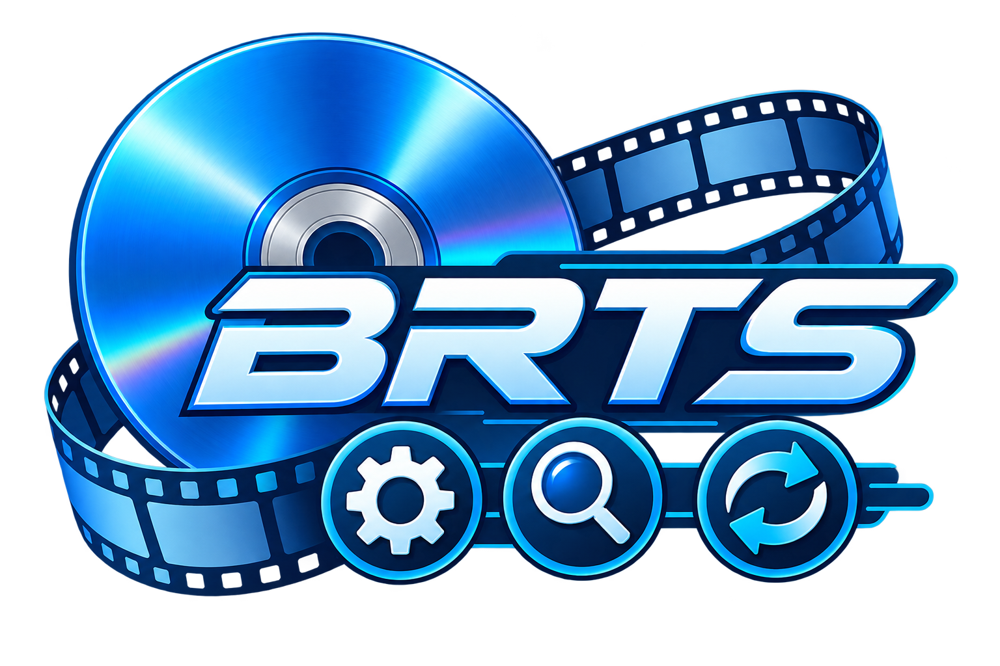

# BRTS — Blu-ray Tools Suite



BRTS is a Java 21 suite of tools for **authoring Blu-ray discs**: it turns MKV
source files and human-readable JSON descriptors into a compliant Blu-ray
folder structure (BDMV, CLIPINF, PLAYLIST, STREAM), and can also parse
existing Blu-ray files back into JSON for inspection and debugging.

<br clear="left"/>

## Goal

- Generate compliant Blu-ray output (M2TS, CLPI, MPLS, BDMV/index/movie
  objects, IGS popup menus) from MKV sources plus JSON descriptors.
- Parse existing Blu-ray binary files back to JSON for traceability, so a
  parser's output can be fed to the matching writer and round-trip the same
  files.
- Stay a *suite* of independent tools rather than one do-it-all binary: every
  step (low, middle, or high level) is usable on its own from the CLI.
- Cover the practical subset of the Blu-ray spec needed for personal/home
  archival authoring. Explicitly out of scope: 3D, multi-angle/PiP,
  `CERTIFICATE`, and DRM/AACS (empty placeholders only).

See [TODO.md](TODO.md) for the current backlog and
[CLI documentation generation](doc/cli-documentation-generation.md) for the release metadata and reference pipeline.

## Structure

The project is a Maven multi-module build with four authoring layers plus a
CLI, in strict dependency order:

```
brts-common        shared utilities, JSON mapping, model classes
   ↑
brts-low-level     binary parsers/writers for each Blu-ray file type
   ↑
brts-middle-level  simplified authoring APIs (auto PID allocation, playlists, menus)
   ↑
brts-high-level    template-driven disc building (movie, TV series, ...)
   ↑
brts-cli           command-line entry point exposing all three levels
```

Lower layers never depend on higher layers. Details in
[doc/architecture.md](doc/architecture.md).

## Usage

All commands go through the CLI fat jar built by `brts-cli`:

```bash
brts <level> <command> [options]

# Levels: low | mid | high
brts low  clip-parse --input BDMV/CLIPINF/00001.clpi
brts mid  build      --descriptor disc.json --output /tmp/out
brts high build      --descriptor movie-disc.json --output /tmp/out
```

Run any level with no command, or a command with `--help`, to list available
options. Full command reference: [doc/cli-reference.md](doc/cli-reference.md).
JSON descriptor formats and examples: [doc/descriptors.md](doc/descriptors.md).

## Building and testing

- Full build: `mvn clean package`
- Full test suite: `mvn test`
- Single module: `mvn -pl <module> clean test`

More details (formatting, CLI packaging, local debug launcher) in
[doc/building.md](doc/building.md).

## Documentation

- [doc/architecture.md](doc/architecture.md) — module layers, package layout, design rules
- [doc/cli-reference.md](doc/cli-reference.md) — full list of CLI commands per level
- [doc/descriptors.md](doc/descriptors.md) — JSON descriptor formats with examples
- [doc/building.md](doc/building.md) — build, test, formatting, packaging, debug launcher
- [doc/roadmap.md](doc/roadmap.md) — planned features and explicit non-goals
